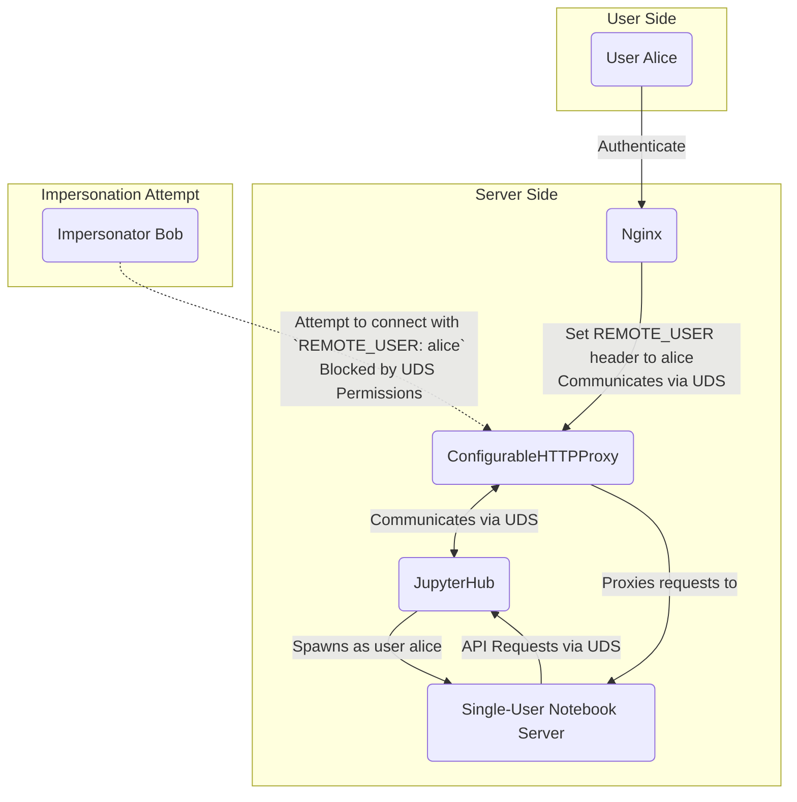

# JupyterHub Deployment with Nginx and Unix Domain Sockets

This repository demonstrates how to securely deploy JupyterHub behind Nginx using Unix Domain Sockets and `REMOTE_USER` authentication, [all on one host](#security-model). The setup leverages Nginx as a reverse proxy, ConfigurableHTTPProxy (CHP), and JupyterHub, prioritizing security in shared-use environments.

This repository uses a specific commit-hash for JupyterHub. Ability to leverage UDS will be included in `JupyterHub>=6.0`.

_Note_: While this setup is intended to illustrate the use of Unix Domain Sockets for security in a particular scenario, note that another usecase for UDS is simply their slight performance gains over TCP sockets (though I am not sure at what scale these would become meaningful).

## Who Should Run This?

This setup is intended for organizations that need to deploy JupyterHub *in a single VM* shared among multiple users, such as a research lab or in an classroom setting.

This setup is **not intended** for environments leveraging Kubernetes or other container orchestration solutions, which may provide better security conditions anyway.

At [Utrecht University](https://github.com/UtrechtUniversity/), this is used to provide Jupyter-based [Virtual Research Environments](https://utrechtuniversity.github.io/vre-docs/docs/workspaces/programming/vre-lab.html) for research groups and classrooms, hosted on [SURF ResearchCloud](https://www.surf.nl/en/services/compute/surf-research-cloud).

## How to Deploy

This repo illustrates the setup explained below using a single Docker container, or alternatively, a Vagrant-provisioned VM.

The Docker example is faster and simpler, but since this setup really only makes sense in shared-VM setting, it is a purely illustrative.

The Vagrant example is a bit closer to a production setup. It uses an example [Ansible playbook](./ansible-playbook.yml) to provision a virtual machine.

### Option 1: Deploy with Docker

1. **Build the Image**:
   ```bash
   docker build . -t jupyterhub-remote-unix-socket
   ```
2. **Run the Container**:
   ```bash
   docker run --name jhub --rm -p 8080:80 localhost/jupyterhub-remote-unix-socket:latest
   ```

3. **Access JupyterHub**:
   Open [http://localhost:8080](http://localhost:8080) in the browser. You will log in as the user `alice` (provided by the `REMOTE_USER` header set in `nginx.conf`).

4. (*Optional*) **Test Permissions**:
   Run `docker exec -it jhub /test.sh` to verify normal users have the right permissions on the sockets.

### Option 2: Deploy with Vagrant

To run this example using Vagrant:

#### Dependencies
Make sure the following are installed on your host machine:

- [VirtualBox](https://www.virtualbox.org/)
- [Vagrant](https://www.vagrantup.com/)
- Ansible (Vagrant will use it to provision the VM)

#### Steps

1. **Start the VM**:
   ```bash
   vagrant up
   ```

2. **Access JupyterHub**:
   Open [http://localhost:8080](http://localhost:8080) in the browser.

---

## Use Cases

This setup is tailored for scenarios where:

1. **Multi-User VMs**:
   - JupyterHub and Nginx are hosted on the same Virtual Machine shared among multiple semi-trusted users.
2. **Local Spawning**:
   - Single-user notebook servers are spawned as local processes rather than containers or separate VMs.
3. **Decoupled Authentication**:
   - Authentication and authorization are handled by an upstream system, which passes `REMOTE_USER` to Nginx.

### Why Unix Domain Sockets?

Using Unix domain sockets instead of traditional TCP sockets prevents direct access to CHP or JupyterHub from semi-trusted users (`alice`, `bob`, etc.). This ensures users cannot [impersonate](#security-model) others or access sensitive endpoints.

## Architecture Overview

This setup consists of:

- **Nginx**: The primary reverse proxy that routes HTTP traffic to ConfigurableHTTPProxy via Unix domain sockets. Nginx adds the trusted `REMOTE_USER` HTTP header for authentication.
- **ConfigurableHTTPProxy (CHP)**: Acts as the intermediary between Nginx and the JupyterHub backend.
- **JupyterHub**: Manages user sessions and spawns single-user Jupyter Notebook servers.
- **Unix Domain Sockets**: All communication between Nginx, CHP, and JupyterHub occurs via Unix domain sockets to enhance security by limiting socket accessibility to authorized users/groups only.
- **`REMOTE_USER` Authentication**: Upstream authentication is handled externally, with the trusted `REMOTE_USER` header forwarded by Nginx.
- **System Users and Groups**:
  - The setup ensures proper access control to Unix domain sockets using Linux users and groups:
    - `nginx` user: Runs the Nginx process and has read/write access to the CHP socket.
    - `jupyter` user: Runs the JupyterHub and CHP process and has read/write access to the JupyterHub and CHP sockets.
    - Single-user servers: Spawned with the individual user’s UID (`alice`, `bob`, etc.), and they only have access to specific resources assigned to them.



### Key Interaction Flows

1. **User Authentication**:
   - Users authenticate via an upstream trusted authentication server.
   - Nginx proxies requests with the `REMOTE_USER` header set to the authenticated username to JupyterHub.

2. **Single-User Server Access**:
   - JupyterHub spawns single-user notebook servers for authenticated users.
   - Single-user/notebook servers access the Hub API via a dedicated Unix Domain Socket, which requires API tokens rather than `REMOTE_USER` for auth.

### Configuration Highlights

- The Nginx configuration:
  - Proxies user requests to CHP (`/run/jupyterhub/chp.sock`).
  - Provides a public endpoint for single-user (notebook) servers to contact the Hub's API, authenticated via tokens.
- **Communication between CHP and the Hub**:
  - CHP communicates with JupyterHub through its Unix Domain Socket (`/run/jupyterhub/jupyterhub.sock`).
  - JupyterHub communicates with CHP's API through Unix Domain Sockets (`/run/jupyterhub/chp-api.sock`).
- **Access Control Settings**:
  - Appropriate file permissions ensure that only the `nginx` and `jupyter` users can access the sockets while preventing unauthorized access by other users.
- **Communication between single-user servers and the Hub API**:
  - Single-user servers must be able to access the Hub's API. Since they are not able to access the main CHP and JupyterHub sockets, we define an additional public `nginx` endpoint (also on a UDS, `/run/jupyterhub_public/jupyterhub-api.sock`) that proxies to the Hub's API.
  - This endpoint does *not* use `REMOTE_USER` auth, so no risk of [impersonation](#threats-addressed).
  - Instead, the Hub API uses tokens for authentication. These are provided to the single-user servers by the Hub at spawn-time.

Note that some single-user servers will still be spawned on TCP ports (this is the case for standard notebook servers, e.g. -- applications that you add using https://jupyter-server-proxy.readthedocs.io/en/latest/ can be made to listen on UDS themselves). This is not a problem as they implement their own authentication mechanism (again via a token provided by the Hub).
 
### Example Users and Groups

- **`alice`, `bob`:** Normal end users who spawn their single-user notebook servers as non-privileged processes under their own UIDs.
- **`jupyter`:** Dedicated system user responsible for running JupyterHub and managing its Unix sockets.
- **`nginx`:** Webserver user. (`www-data` in the Vagrant example)
- **Groups:** `alice` and `bob` are in a group for Hub users, `jupyterhub`. The Hub (`jupyter`) has permission to spawn single-user servers as any user in the group `jupyterhub` (using `SudoSpawner`). 

## Security Model

Our setup assumes two constraints:

- JupyterHub is run on the same VM on which single-user servers are spawned.
- The hub relies on `REMOTE_USER` (trusted header) authentication.

Given these constraints, with CHP or JupyterHub running on TCP sockets on localhost, any user on the system could hit CHP or the Hub with `curl -H "REMOTE_USER: bob" http://localhost:8000` and impersonate an arbitrary user.

Unix domain sockets restrict communication to specific users and processes, offering a layer of security not present with TCP sockets. Permissions ensure only `nginx` and `jupyter` can interact with sockets at the appropriate levels.

### Threats Addressed

- **Inter-user Impersonation**:
  Prevents semi-trusted users (e.g., researchers, students) from accessing each other's data or spawning Jupyter servers under another identity.

### Threats Mitigated

- **Remote code execution vulnerabilities in JupyterHub**: we use `SudoSpawner` to ensure the Hub does not need to run as `root`, mitigating some of the consequences of remote code execution vulnerabilities.

### Exclusions

- **System Administrator Access**:
  Root users can override all permissions and access data from all users.
- **Local Root Exploits**: same as above.
- **Attacks on single-user servers**:
  If a spawned single-user server listens on a TCP port, it can still be connected to from `localhost`. Any vulnerabilities in the single-user server authentication mechanism (provided by `jupyterhub`) are not mitigated by this setup.
- **Upstream Authentication**:
  The setup assumes the upstream authentication server is trusted and secure.
